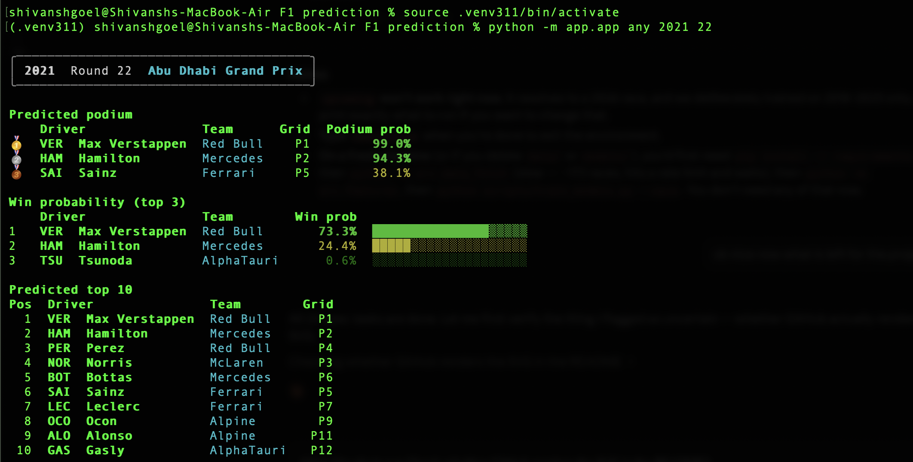
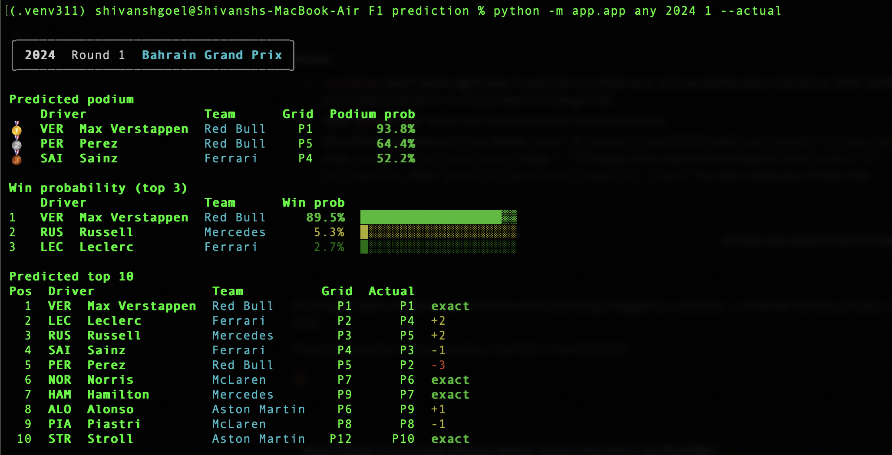
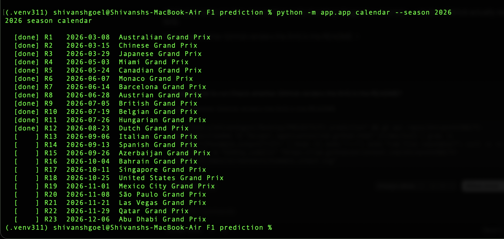

# F1 Race Predictor

Predicts Formula 1 race outcomes from information available **before lights out** — qualifying, grid, and rolling driver/constructor form. Three XGBoost models: podium finish, finishing position, and race winner.

Built on [FastF1](https://docs.fastf1.dev/). 2018–2025, 173 races, 3,455 driver-race rows. No paid APIs.

---

## Results

Two different questions get two different answers, and the gap between them is the most interesting thing in this project.

### Cross-validation (season-forward, time-respecting)

Every fold trains only on seasons *strictly before* the season it is scored on — test seasons 2021–2025. This is stricter than grouping by season, which would still allow training on 2025 to predict 2018.

| Model | Metric | Result | Original benchmark |
|---|---|---|---|
| Podium | CV AUC | **0.9258** | 0.934 |
| Podium | CV LogLoss | **0.2491** | 0.269 ✅ better |
| Position | CV MAE | **3.3330** | 3.626 ✅ better |
| Position | CV RMSE | 4.5195 | — |
| Winner | CV AUC | **0.9468** | — |
| Winner | CV LogLoss | 0.1209 | — |
| Winner | Top-1 accuracy | 50.0% | — |

These reproduce the original project's figures closely — within ~1% on podium AUC, and better on both LogLoss and MAE — while using a split that doesn't leak the future.

### Backtest on real races — the number that actually matters

CV scores are aggregate and abstract. This is 114 completed races (2021–2025), each predicted by models trained only on earlier seasons, scored against a baseline of **simply predicting the grid order** (pole wins, front three are the podium, everyone finishes where they started).

| Metric | Model | Grid baseline | Gap |
|---|---|---|---|
| Winner accuracy | 50.0% | **54.4%** | −4.4% |
| Podium hit rate | 64.3% | **67.8%** | −3.5% |
| Position MAE | 3.48 | **3.42** | +0.06 |

**The model does not beat the grid-order baseline.** On real races, "assume everyone finishes where they qualified" is slightly better than the trained model on all three metrics.

This is reported rather than tuned away, because tuning against this backtest and then quoting it would destroy the only thing that makes it worth quoting. The baseline was verified independently before drawing the conclusion — recomputed straight from the feature table, the pole-sitter really does win 54.4% of these races.

The per-season split shows why:

| Season | Model | Baseline | |
|---|---|---|---|
| 2021 | 36.4% | 50.0% | |
| 2022 | 31.8% | 45.5% | |
| 2023 | **81.8%** | 63.6% | ← Verstappen won 19 of 22 |
| 2024 | 37.5% | 45.8% | |
| 2025 | 62.5% | 66.7% | |

The model wins big in 2023, a season one driver dominated, and loses whenever the competitive order shifted. In 2024 it predicted Verstappen **13 times in races someone else won** — it had learned 2023's pecking order from driver and constructor identity and carried that stale prior into McLaren's rise.

### Calibration — does "40%" mean 40%?

Not at the confident end. Same walk-forward, out-of-sample predictions:

| Predicted band | n | Predicted | Observed | Gap |
|---|---|---|---|---|
| 0.4–0.6 | 41 | 49.9% | 34.1% | −15.8% |
| 0.6–0.8 | 33 | 68.7% | 69.7% | +1.0% |
| 0.8–1.0 | 34 | 87.8% | **58.8%** | **−29.0%** |

When the model says a driver is 80–100% to win, they win **59%** of the time.

Overall Expected Calibration Error is **0.0144**, which looks excellent and is misleading: 1,663 of 2,275 driver-races sit in the bottom band, are correctly given ~0%, and contribute almost no error. Restricted to predictions above 20% — the ones anyone would act on — ECE is **0.1167**, roughly 8× worse.

Brier score is 0.0335 against a base-rate baseline of 0.0476, so the probabilities do carry real information. They are simply too confident.

---

## Setup

Requires Python 3.11.

```bash
python3.11 -m venv .venv311
source .venv311/bin/activate
pip install -r requirements.txt
```

Fetch the data and build the models (the first fetch pulls ~173 races and takes a while — FastF1 rate-limits at 500 calls/hour, and the script backs off and resumes on its own):

```bash
python -m src.data_fetch
python -m src.features
python scripts/train_models.py --save
```

---

## Usage

```bash
python -m app.app upcoming
```

```bash
python -m app.app latest --season 2025
```

```bash
python -m app.app any 2021 22 --top 10
```

```bash
python -m app.app calendar --season 2026
```

Add `--actual` to compare predictions against the real result, and `--fetch` to pull a round that isn't cached locally.

### Evaluation

```bash
python scripts/eval_past.py --misses
```

```bash
python scripts/eval_winners.py
```

### Keeping data current

Fetches only the rounds that are actually missing, rather than re-pulling whole seasons:

```bash
python scripts/update_training_data.py
```

---

## Sample output

### Predicting a race

`python -m app.app any 2021 22` — the 2021 Abu Dhabi title decider, with Verstappen and Hamilton arriving level on points:



### Comparing against the real result

`python -m app.app any 2024 1 --actual` adds the true finishing position and a signed delta, so you can see where the model was right and where it wasn't:



Verstappen called exactly; Perez predicted P5 and finished P2.

### Season calendar

`python -m app.app calendar --season 2026` — the live schedule, marking which rounds have run:



---

## Limitations

### What the model cannot see

Every feature is fixed before lights out. Everything that decides a Grand Prix after that is invisible to it: **safety cars and red flags**, **weather changes mid-race**, **first-lap collisions**, **pit strategy and undercuts**, **tyre degradation**, **mechanical failures**, and **team orders**.

This is measurable, not hypothetical. Splitting the backtest by whether a driver actually finished:

| | Mean position error | n |
|---|---|---|
| Finished | **2.90** | 1,965 |
| Did not finish | **7.12** | 310 |

DNFs are 13.6% of driver-races and carry 2.5× the error. Excluding them, MAE falls from 3.48 to 2.90 — so roughly a sixth of the model's total error comes from outcomes no pre-race feature could have predicted. A retirement on lap 3 is not a modelling failure; it is a car breaking.

Error also rises steadily down the field, which is where chaos concentrates:

| Actual finish | Mean position error | n |
|---|---|---|
| 1–3 | 1.85 | 342 |
| 4–10 | 3.16 | 798 |
| 11–20 | 4.19 | 1,135 |

### Where it is systematically wrong

**It does not beat predicting the grid order.** Stated again here because it is the single most important caveat: across 114 real races the model is worse than assuming everyone finishes where they qualified, on winner accuracy, podium hit rate, and position error alike.

**It over-anchors on driver and constructor identity.** The clearest failure in the dataset: in 2024 it predicted Verstappen as winner in **13 races he did not win**. It had learned 2023's order — where he won 19 of 22 — and carried that prior into a season where McLaren became the quicker car. The model adapts to a shifting competitive order roughly a season late.

**It is over-confident exactly where confidence matters.** At a stated 80–100% win probability, the driver wins 58.8% of the time. Treat high probabilities as strong preferences, not as odds.

**It is weakest in transition years and strongest in dominant ones.** It beat the baseline decisively in 2023 and lost in every other backtested season. A model that only outperforms when one driver is winning most races is not adding much: that is the season you least need a model for.

**Upsets are invisible to it by construction.** In 14% of races the winner started outside the top three — the races most worth predicting are the ones where pre-race form is least informative.

**Regulation changes break the learned order.** 2022's ground-effect rules reset the competitive picture, and the model has no feature representing "the cars are different now". `season` is included, but it cannot anticipate a regime shift it has not yet seen.

**New drivers have no history.** A debut driver's rolling-form, DNF-rate and standings features are null, and their identity is an unseen category. XGBoost handles this natively rather than guessing, but such a driver is predicted almost purely from grid position.

### Scope

- **Training data is 2018–2025.** The live 2026 season is deliberately excluded — training on a part-run season would skew rolling-form and standings features. `python -m app.app upcoming` reads the live calendar independently, so it works once a round's qualifying data is fetched.
- **Predicting a race inside the training range is in-sample** and will look better than the model's true skill. `scripts/eval_past.py` is the honest measurement.
- **Requires qualifying to have run.** A race has no grid until then, which in practice means predictions are only possible from the day before.
- **Sprint points are included** in championship standings, but sprint results themselves are not used as a form signal.

---

## How it works

**Features** (`src/features.py`) — one row per driver-race, every value computable strictly before the race starts: grid, qualifying position, Q1/Q2/Q3 times, rolling driver and constructor form, championship points and standing entering the round, DNF rates, circuit, and season.

**No leakage** is enforced at runtime, not by convention. `assert_no_leakage` raises if any post-race column reaches the model, rolling features use a strict backward shift, and the test suite plants a leak to confirm the assertion actually fires.

**One source of truth** — training and prediction both call `features.build_model_matrix`, and each model's categorical mapping is persisted inside its own artifact. Re-deriving categories at predict time would silently remap driver identities.

**Validation** — `season-forward` folds for CV, and a separate walk-forward backtest that never scores a race with a model that saw it.

### Project layout

```
src/        core library — config, data_fetch, features, train, predict, render
app/        CLI entrypoints — app.py plus the predict_* variants
scripts/    train_models, eval_past, eval_winners, update_training_data
tests/      179 tests
data/       raw/ and processed/ (gitignored — regenerable)
models/     *.joblib artifacts (gitignored — regenerable)
```

The original project had `prediction1.py` through `prediction24.py` — 24 near-identical files, one per round, plus three `pretty_*.py` variants. All 27 are replaced by a single parameterized `render_round(season, round_number)`.

### Tests

```bash
python -m pytest tests/ -q
```

179 tests. The ones worth knowing about assert the properties that fail silently rather than loudly: that CV folds never train on future seasons, that rolling features can't see the race they describe, that win probabilities sum to 1.0 per race, and that the backtest's baseline is computed independently of the model.
